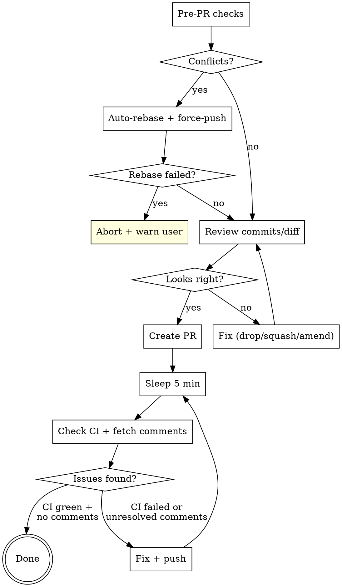

# Creating Pull Requests

## PR Lifecycle



## PR Title

Format: `[PROJ-XXXX] Sentence case description`

- Bracket the Jira ticket: `[PROJ-6082]`, not `PROJ-6082:`
- After the prefix, sentence case -- first word is an imperative verb
- Examples:
  - `[PROJ-6082] Add cutover date to billing dashboard`
  - `[PROJ-2740] Fix order closure race condition`
  - `[NO-JIRA] Bump dependency versions`

## PR Description

Explain like you're speaking to a TPM. Prefer brevity, but not at the cost of clarity.

Template:

```markdown
#### Description

...

#### Stakeholders

...

#### References

- https://$ATLASSIAN_SITE/browse/PROJ-XXXX
```

### Section guidance

| Section | Content |
|---------|---------|
| **Description** | What changed and why, in plain language. Bullet points preferred. |
| **Stakeholders** | @ mention people who need to know or review. Omit if obvious. |
| **References** | Jira ticket link. Add Slack threads, Confluence pages, or related PRs if relevant. |

## Pre-PR Checks

Run these before `gh pr create`:

### 1. Check for merge conflicts

```bash
git fetch origin main
git rebase origin/main
```

If rebase succeeds, force-push the rebased branch. If rebase fails (conflicts can't be auto-resolved), `git rebase --abort` and warn the user.

### 2. Verify commits and diff

```bash
git log origin/main..HEAD --oneline
git diff origin/main...HEAD --stat
```

Sanity-check: are these the commits and files you expect? Use best judgement -- if something looks wrong (unrelated commits, unexpected files, merge commits from another branch), fix it (drop, squash, amend). If it looks clean, proceed.

## Post-PR Monitoring

After creating the PR, enter a monitoring loop. No maximum iterations -- loop until CI is green and all comments are resolved.

### Loop body

1. **Sleep 5 minutes** -- `sleep 300`
2. **Check CI and comments** (both, every iteration):
   - **CI status**:
     - GitHub Actions: `gh pr checks <number>`
     - Azure DevOps: use `az pipelines` commands (discover the right invocation for the repo)
     - If failed, investigate logs and fix
   - **Inline comments**:
     ```bash
     gh api repos/{owner}/{repo}/pulls/{number}/comments \
       --jq '.[] | {id: .id, user: .user.login, body: .body[:120], path: .path, line: .line}'
     ```
     - If actionable (Gemini bot or colleague), fix the code and reply inline
     - If it needs human decision, surface it to the user
     - See the `reviewing-github-prs` skill for how to reply to comment threads
3. **If anything was fixed**, push and go back to sleep. Otherwise:

### Exit condition

Loop ends when **both** are true in the same iteration:
- All CI checks pass (or are still pending -- sleep again if pending)
- No unresolved inline comments remain
