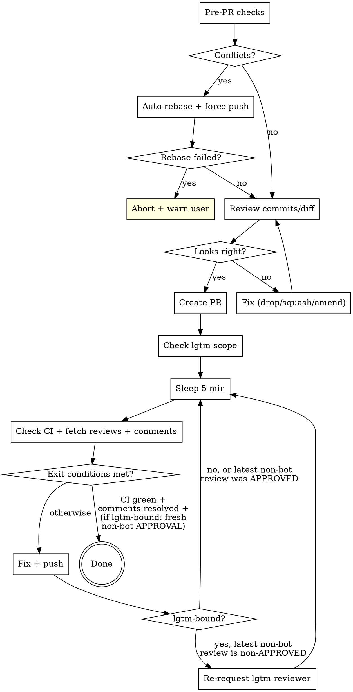

# Creating Pull Requests

## PR Lifecycle



## PR Title

Format: `[PROJ-XXXX] Sentence case description`

- Bracket the Jira ticket: `[PROJ-6082]`, not `PROJ-6082:`
- After the prefix, sentence case -- first word is an imperative verb
- Examples:
  - `[PROJ-6082] Add cutover date to billing dashboard`
  - `[PROJ-2740] Fix order closure race condition`
  - `[NO-JIRA] Bump dependency versions`

## PR Description

Explain like you're speaking to a TPM. Prefer brevity, but not at the cost of clarity.

Template:

```markdown
#### Description

...

#### Stakeholders

...

#### References

- https://$ATLASSIAN_SITE/browse/PROJ-XXXX
```

### Section guidance

| Section | Content |
|---------|---------|
| **Description** | What changed and why, in plain language. Bullet points preferred. |
| **Stakeholders** | @ mention people who need to know or review. Omit if obvious. |
| **References** | Jira ticket link. Add Slack threads, Confluence pages, or related PRs if relevant. |

## Pre-PR Checks

Run these before `gh pr create`:

### 1. Check for merge conflicts

```bash
git fetch origin main
git rebase origin/main
```

If rebase succeeds, force-push the rebased branch. If rebase fails (conflicts can't be auto-resolved), `git rebase --abort` and warn the user.

### 2. Verify commits and diff

```bash
git log origin/main..HEAD --oneline
git diff origin/main...HEAD --stat
```

Sanity-check: are these the commits and files you expect? Use best judgement -- if something looks wrong (unrelated commits, unexpected files, merge commits from another branch), fix it (drop, squash, amend). If it looks clean, proceed.

**Always compare against `origin/<trunk>`, never local `<trunk>`.** Local `main`/`master` can be ahead of origin (unpushed commits from prior sessions, especially in worktrees where the parent repo's local trunk drifts). `git log master..HEAD` will silently hide stowaway commits, and the rebase in step 1 won't strip them either -- `origin/<trunk>` is already an ancestor of your branch, so rebase is a no-op.

If `git log origin/<trunk>..HEAD --oneline` shows more commits than you authored this session, you have stowaways. Fix:

```bash
git rebase --onto origin/<trunk> <local-trunk> <your-branch>
```

This replays only your branch-tip commits onto `origin/<trunk>`, dropping everything between `origin/<trunk>` and `<local-trunk>`.

## Post-PR Monitoring

After creating the PR, enter a monitoring loop. No maximum iterations -- loop until exit conditions (below) are all met in the same iteration.

### Once, before the loop: determine if this PR is lgtm-bound

`~/projects/lgtm` runs an AI review daemon on a configured set of repos. If this PR is in scope, you MUST wait for a non-bot reviewer (lgtm dispatches under a real human GitHub identity) to APPROVE before exiting -- CI green + comments resolved is necessary but not sufficient. lgtm typically dispatches within ~10 min of CI going green.

```bash
# Grep the repo key out of the YAML. Matches lines like "  food-truck/mono:"
# (two-space indent, repo key, trailing colon). Avoids a yq dependency.
grep -qE "^  <owner>/<repo>:" ~/projects/lgtm/lgtm.yml && echo lgtm-bound
```

If `~/projects/lgtm/lgtm.yml` doesn't exist on this machine (e.g. devbox), treat the PR as **not lgtm-bound** and proceed with the simpler exit condition. Repo presence is sufficient -- don't try to replicate lgtm's `paths:` sub-filter; if lgtm ends up skipping the PR you'll just be over-waiting, which the user can short-circuit.

Cache the answer in a shell var (e.g. `LGTM_BOUND=yes`) for the loop.

### Loop body

1. **Sleep 5 minutes** -- `sleep 300` (in its own bash invocation, not chained with subsequent `gh` calls -- see AGENTS.md guidance on bundled sleeps)
2. **Check CI**:
   - GitHub Actions: `gh pr checks <number>`
   - Azure DevOps: use `az pipelines` commands (discover the right invocation for the repo)
   - If failed, investigate logs and fix
3. **Fetch reviews** (the formal review verdicts, distinct from inline comments):
   ```bash
   gh api repos/{owner}/{repo}/pulls/{number}/reviews \
     --jq '.[] | {id, login: .user.login, type: .user.type, state, submitted_at}'
   ```
   - Group by `login`, take the **latest** review per reviewer (reviews are append-only; only the most recent counts)
   - `type: "Bot"` -> Gemini, dependabot, etc. Address inline comments per step 4 but **never re-request review from a bot login**.
   - `type: "User"` -> human OR an lgtm-dispatched session running under a real human PAT. Both look identical and are treated the same way: address feedback AND re-request review from this login after pushing fixes.
4. **Fetch inline comments and reply**:
   ```bash
   gh api repos/{owner}/{repo}/pulls/{number}/comments \
     --jq '.[] | {id, login: .user.login, type: .user.type, in_reply_to_id, body: .body[:120], path, line}'
   ```
   - For each thread root (`in_reply_to_id: null`) without your reply: fix the code if actionable, then reply in-thread per the `reviewing-github-prs` skill. Applies to bot AND human threads.
   - If it needs human decision, surface it to the user before continuing
5. **If anything was fixed in steps 2-4**, push, then:
   - **If lgtm-bound AND the most recent non-bot review exists AND its `state != "APPROVED"`** (i.e. `CHANGES_REQUESTED` or `COMMENTED` -- they asked for changes, you addressed them, now they need to look again), re-request review from that reviewer's login (see below). This puts the PR back on lgtm's tier-0 reawaken track so the same dispatched session resumes.
   - **If the most recent non-bot review was already `APPROVED`**, do NOT re-request -- they signed off; you're just mopping up leftover inline threads. The approval stays valid; pushing fixes for inline-only feedback does not invalidate sign-off.
   - Go back to sleep (step 1).
6. **Otherwise** (nothing to fix this iteration), evaluate exit conditions.

### Re-requesting review from the lgtm reviewer

```bash
gh api -X POST repos/{owner}/{repo}/pulls/{number}/requested_reviewers \
  -f 'reviewers[]=<login>'
```

Use the exact `login` from the most recent non-bot review. lgtm rotates through a pool (`reviewers:` in `lgtm.yml`); on a re-review request it pins to whoever last reviewed via its fresh-fallback path, so honoring the *specific* prior login matters. Do not re-request from any bot login (`type: "Bot"`) -- Gemini and friends don't participate in the lgtm reawaken flow and re-requesting is a no-op at best, noise at worst.

### Exit condition

Loop exits only when **all** of the following are true in the same iteration:

- All CI checks pass (pending -> sleep again)
- Every thread-root inline comment has your reply (bot AND human threads)
- **If lgtm-bound**: the most recent review from a non-bot reviewer has `state == "APPROVED"`. An earlier-than-last-push approval still counts -- once they've signed off, fixes for inline-only feedback do not invalidate it. (If a reviewer wanted you to re-prove correctness, they would have left `CHANGES_REQUESTED` instead of `APPROVED`.)
- **If not lgtm-bound**: no review-state requirement; the first two bullets are sufficient.

### Common mistakes

- **Exiting after Gemini's comments are resolved but before the human/lgtm review lands.** CI green + Gemini-thread replies is not enough on lgtm-bound repos. Wait for the non-bot APPROVED.
- **Re-requesting review from a bot login.** Bots aren't on the lgtm reawaken loop; the request is wasted. Filter on `user.type != "Bot"` before re-requesting.
- **Re-requesting review after an APPROVED.** If the latest non-bot review is already `APPROVED`, don't re-request when you push fixes for leftover inline threads. The reviewer signed off; pinging them again to re-confirm is noise. Re-request only when the latest non-bot review is `CHANGES_REQUESTED` or `COMMENTED`.
- **Re-requesting from the wrong login.** lgtm's reviewer pool rotates, but on re-review it pins to the prior reviewer. Always use the exact login from the most recent non-bot review, not a hardcoded default.
- **Bundling `sleep 300` with the follow-up `gh` calls in one bash invocation.** Long chained one-liners that include `sleep` are a known hang risk in this environment (see AGENTS.md). Run `sleep 300` as its own tool call, then run the checks.
