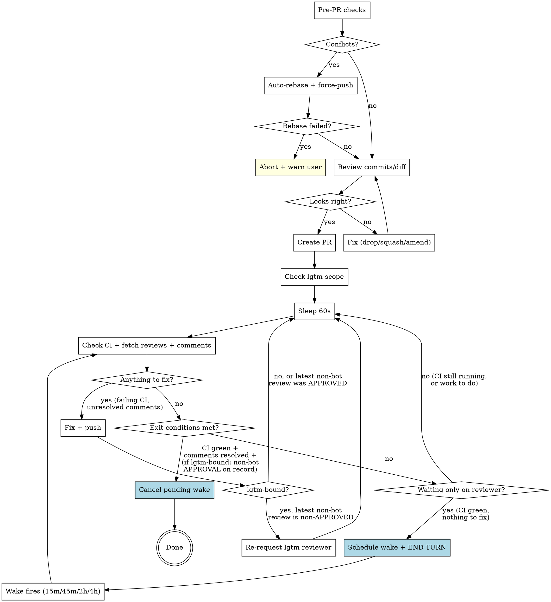

# Shepherding Pull Requests

A PR being open is not the end of the work — it's the middle of it. Opening the PR creates a coordination cost on the reviewer's plate; walking away mid-flight pushes the rest of that cost (chasing CI, addressing comments, re-requesting review) back onto the user. The job is to land the PR or hand it off with an honest, current status. Everything in this skill is in service of that disposition.

## The standing expectation

**None of this has to be requested.** A user who tells you to reply to the comments and re-request the reviewer is repeating a default you already owed them. Treat the moment `gh pr create` returns as the start of the obligation, not the discharge of it — and treat a clean, green, uncommented PR as still owed, because it is.

From that moment, without being asked:

- **Hold the PR.** Stay in the loop until it lands, or until there is a genuine human decision only the user can make. → §"Post-PR Monitoring"
- **When a review lands, reply to every inline comment in its own thread, and mark each thread resolved.** Both, every thread, bot and human alike. → §"Loop body" step 4
- **Act on the substance with judgment** — accept, push back, or escalate. Nothing gets silently dropped. → `receiving-code-review`
- **If the gating reviewer has not APPROVED, re-request them** after pushing fixes. If they already approved, do not. → §"Re-requesting review from the lgtm reviewer"

Reporting a PR URL and treating the task as finished is the specific failure this skill exists to prevent.

## PR Lifecycle



## PR Title

Format: `[PROJ-XXXX] Sentence case description`

- Bracket the Jira ticket: `[PROJ-6082]`, not `PROJ-6082:`
- After the prefix, sentence case -- first word is an imperative verb
- Examples:
  - `[PROJ-6082] Add cutover date to billing dashboard`
  - `[PROJ-2740] Fix order closure race condition`
  - `[NO-JIRA] Bump dependency versions`

## PR Description

Explain like you're speaking to a TPM. Prefer brevity, but not at the cost of clarity.

Template:

```markdown
#### Description

...

#### Stakeholders

...

#### References

- https://$ATLASSIAN_SITE/browse/PROJ-XXXX
```

### Section guidance

| Section | Content |
|---------|---------|
| **Description** | What changed and why, in plain language. Bullet points preferred. |
| **Stakeholders** | @ mention people who need to know or review. Omit if obvious. |
| **References** | Jira ticket link. Add Slack threads, Confluence pages, or related PRs if relevant. |

## Pre-PR Checks

Run these before `gh pr create`:

### 1. Check for merge conflicts

```bash
git fetch origin main
git rebase origin/main
```

If rebase succeeds, force-push the rebased branch. If rebase fails (conflicts can't be auto-resolved), `git rebase --abort` and warn the user.

### 2. Verify commits and diff

```bash
git log origin/main..HEAD --oneline
git diff origin/main...HEAD --stat
```

Sanity-check: are these the commits and files you expect? Use best judgement -- if something looks wrong (unrelated commits, unexpected files, merge commits from another branch), fix it (drop, squash, amend). If it looks clean, proceed.

**Always compare against `origin/<trunk>`, never local `<trunk>`.** Local `main`/`master` can be ahead of origin (unpushed commits from prior sessions, especially in worktrees where the parent repo's local trunk drifts). `git log master..HEAD` will silently hide stowaway commits, and the rebase in step 1 won't strip them either -- `origin/<trunk>` is already an ancestor of your branch, so rebase is a no-op.

If `git log origin/<trunk>..HEAD --oneline` shows more commits than you authored this session, you have stowaways. Fix:

```bash
git rebase --onto origin/<trunk> <local-trunk> <your-branch>
```

This replays only your branch-tip commits onto `origin/<trunk>`, dropping everything between `origin/<trunk>` and `<local-trunk>`.

## Post-PR Monitoring

This is where most of the actual shepherding happens, and where it's easiest to bail early. Two failure modes to watch for in yourself:

- **Treating "PR created" as a terminal state.** It isn't. CI hasn't run yet, no human has looked, no inline comments exist to address. Returning to the user at this point with a PR URL is handing them a tool to do work you were going to do; that's only the right move if you're genuinely blocked or out of scope.
- **Treating the loop as a checklist to satisfy rather than an outcome to own.** The exit conditions below describe the *minimum* state at which you can fairly say "this PR is landed or as landed as I can get it." If you find yourself looking for a reason to declare victory, you've inverted the disposition.

The right framing: you're holding the PR until it's merged or until there's a real human decision the user has to make. Polling every 60 seconds is cheap; bailing and making the user pick up the thread is expensive.

After creating the PR, enter the monitoring loop. There is no maximum number of iterations and no point at which an unmerged PR stops being yours.

**But watching is not the same as polling.** The tight 60-second loop is the right instrument only while something is actively changing — CI running, threads to answer, a push in flight. Once CI is green and the only thing left is a reviewer who hasn't looked yet, the loop is burning turns to re-read a page that nobody has edited. At that point hand off to the watchdog (below): schedule a wake, end the turn, come back when there is plausibly something to see. What changes at CI-green is the *mechanism*, never the obligation.

### Tooling: monitor-pr.py

A companion script bundled with this skill does steps 1-4 of the loop body (sleep, check CI, fetch reviews, fetch inline comments) in one invocation, and prints the exact action to take next:

```bash
python ~/.config/opencode/skills/shepherding-pull-requests/monitor-pr.py [PR]
```

Each invocation has a wall-clock budget of 60 seconds. That cap is deliberate -- Anthropic's prompt-cache TTL is 5 minutes, and a single bash call that blocks the model longer than that expires the warm cache. **While CI is still moving you are expected to re-invoke the script in a loop**; the script owns the within-60s pacing, you own the loop and the fix step. Once CI is green and only the reviewer is outstanding, stop looping and hand off to the watchdog.

| Exit code | Meaning | What to do |
|---|---|---|
| `0` | All exit conditions met | Done. PR is landable. |
| `1` | Action needed (CI failed / unresolved threads / non-APPROVED review predates HEAD) | Read stdout for the specific action, do it (step 5 below), then re-invoke. |
| `2` | Unrecoverable error (could not query GitHub) | Surface to user; don't silently retry. |
| `3` | Budget elapsed, still idle-waiting (CI pending or lgtm-bound waiting on APPROVAL) | Re-invoke immediately **if CI is still moving**. If CI is green and you are only waiting on a reviewer, schedule a wake and end the turn — see "The watchdog" below. |

`--once` runs exactly one evaluation pass and never sleeps. Use it for watchdog wakes, where the session is awake only long enough to check state and then either act or reschedule. (It is equivalent to `--budget-seconds 0`, which already behaved this way; the flag exists to say so out loud and to print the right follow-up instruction.)

`--lgtm-bound auto` (default) reads `~/projects/lgtm/lgtm.yml` to detect lgtm-boundness -- checking both that the repo is listed AND that the PR's author is in an author allowlist (see "Once, before the loop" for why the second half is load-bearing) -- so the manual grep there can be skipped when the script is in use. Use `--lgtm-bound yes` / `--lgtm-bound no` to override.

**Prefer `auto`, and treat an override as a claim you owe evidence for.** The detector re-reads `lgtm.yml` on every run, so `auto` tracks config changes; a hardcoded `--lgtm-bound no` does not, and outlives whatever justified it. When you do override, the script now runs the detector anyway and labels the printed value `OVERRIDE ...` — warning on stderr when the two disagree. **A line reading `lgtm-bound: False` under an override is your own flag echoed back, never a confirmation of it.** If you are putting an override in a resumption prompt, quote the auto value beside it, because the post-compaction session cannot see how you derived it.

**What the script does NOT do:** step 5 (the fix step -- investigating failed CI, replying to inline threads, calling `resolveReviewThread`, pushing fixes, re-requesting review). Those stay yours. The script just tells you what to fix and lets you back in to do it.

The text loop body below documents the same logic by hand. Read it to understand what the script is doing -- and use it directly when working in an environment that doesn't have the script deployed.

### Approval is durable

Worth stating up front because it shapes the whole loop: **once a non-bot reviewer has APPROVED, that approval stays valid through subsequent pushes for inline-only feedback.** GitHub does not auto-dismiss approvals on push (unless the repo opts into that setting, which none of ours do). You do not need a fresh re-approval every time you address a leftover Gemini thread or fix a typo a human pointed out — the reviewer signed off on the substance; mopping up cosmetic feedback doesn't reopen the substance.

This matters in two places:

- **Re-requesting review**: don't, after an APPROVED. It's noise to the reviewer and (on lgtm-bound repos) wastes a tier-0 reawaken slot.
- **Exit conditions**: an earlier-than-last-push APPROVAL still counts. You don't have to wait for them to come back and re-approve.

If the reviewer wanted to re-prove correctness on every push, they would have left `CHANGES_REQUESTED` instead of `APPROVED`. Trust the verdict they actually gave.

### Two reviews, two roles

On a typical lgtm-bound PR you should expect to see two reviews land at very different times, with very different weight. Knowing which one you're waiting for keeps the loop honest:

| Reviewer | When it shows up | Identity in API | Role |
|---|---|---|---|
| Gemini (or other bot reviewer) | Within minutes of opening or pushing | `user.type: "Bot"` | **Advisory.** First-class when present -- read its comments carefully, address actionable threads in-line, push fixes. But its review verdict does not gate exit, on lgtm-bound or non-lgtm-bound repos. Never re-request review from it. |
| lgtm-dispatched session | ~10 min after CI goes green | `user.type: "User"` (it runs under a real human PAT, indistinguishable from a flesh-and-blood reviewer) | **Gating, on lgtm-bound repos.** This is the review you are actually waiting for. CI green + Gemini-threads-resolved is *not* a substitute -- it's a precondition for lgtm to even start. |

The temporal asymmetry is the trap. Gemini fires early, your inline-comment work is mostly done within an iteration or two, and the loop starts to feel finished. It isn't -- on lgtm-bound repos, the gating review is still ~10 min out, possibly more if CI just turned green. That's normal. Poll through it.

On non-lgtm-bound repos (this workstation repo, personal projects, OSS), there is no second review coming. Gemini's review still doesn't gate, but neither does any other -- exit on CI green + inline threads resolved.

### Once, before the loop: determine if this PR is lgtm-bound

`~/projects/lgtm` runs an AI review daemon on a configured set of repos. If this PR is in scope, you MUST wait for a non-bot reviewer (lgtm dispatches under a real human GitHub identity) to APPROVE before exiting -- CI green + comments resolved is necessary but not sufficient. lgtm typically dispatches within ~10 min of CI going green.

**Two conditions, and repo presence is only the first.** A PR is lgtm-bound iff the repo is listed AND the PR's **author** is admitted. The effective allowlist is `authors ∪ reviewers ∪ repos[R].authors` (plus `onRequestAuthors`, which is admitted only when an lgtm reviewer is explicitly requested). **`reviewers` is in that union** — lgtm treats its reviewer pool as implicitly-trusted authors, since they are already trusted enough to review as. Source of truth is `filterByAuthors` in `lgtm/src/discover.ts`; `monitor-pr.py` implements it, including the back-compat rule that no author config at all means no filtering.

```bash
REPO=<owner>/<repo>; AUTHOR=$(gh pr view <n> --json author --jq .author.login)
grep -qE "^  ${REPO}:" ~/projects/lgtm/lgtm.yml || echo "NOT lgtm-bound (repo not listed)"
# Author admitted? Any of authors / reviewers / repo authors / onRequestAuthors.
# Crude; prefer monitor-pr.py, which parses the sections properly.
grep -qE "^  - ${AUTHOR}$|^      - ${AUTHOR}$" ~/projects/lgtm/lgtm.yml \
  || echo "NOT lgtm-bound (author in no allowlist)"
```

If `~/projects/lgtm/lgtm.yml` doesn't exist on this machine (e.g. devbox), treat the PR as **not lgtm-bound**.

> ⚠ **DO NOT INFER LGTM-BOUNDNESS FROM CONFIG SHAPE — READ `discover.ts`, OR JUST WAIT LONGER.** This warning exists because the author of this very section got it wrong in the expensive direction and nearly shipped the error.
>
> The reasoning went: *"my login appears in `lgtm.yml` only under `reviewers:`, never in an author list, and lgtm is my own daemon so it won't review my own PRs — therefore this PR can never be dispatched and polling is futile."* Structurally plausible, internally consistent, and **false**. `reviewers` is part of the author union, and the daemon dispatched **7 minutes after polling stopped**. The correct action had been to keep waiting; the "finding" was a false positive produced by reading config layout instead of the dispatch code.
>
> **Recognising this trap is not the same as avoiding it** — it reads as familiar, and the familiarity is easy to mistake for having checked. Get the value rather than matching the shape: run `monitor-pr.py`, which prints the detection, or read `filterByAuthors`.
>
> **The generalisable trap: a config file tells you what is configured, not what the program does with it.** `reviewers:` and `authors:` look like disjoint roles and are unioned one function call away. If you need to know whether a daemon will act, read the code that decides, or observe it — do not derive it from key names.
>
> **What survives, and is why the author check is still here:** for an author in *none* of those lists, repo-presence alone is genuinely wrong, and the failure is asymmetric —
>
> | filter wrong | consequence | cost |
> |---|---|---|
> | `paths:` | gate opens for other PRs; you over-wait on this one | **bounded** — user short-circuits |
> | **`authors:`** | gate **never** opens for this author | **unbounded** — waits for an approval that cannot arrive |
>
> A safety argument that holds for a bounded delay and gets silently reused for an unbounded one is its own defect class — which is why the check is worth having even though the case that prompted it turned out not to be an instance.
>
> **Fail toward lgtm-bound (keep waiting) when unsure.** Over-waiting is visible and interruptible; a wrong early exit looks like a decision and silently drops the PR. Note this is the opposite of what an earlier draft of this section said.

Cache the answer in a shell var (e.g. `LGTM_BOUND=yes`) for the loop.

### Loop body

> **Preferred:** invoke `monitor-pr.py` (see "Tooling" above) instead of doing steps 1-4 by hand. The script encodes the same logic and returns exit codes that map to "done" / "fix this" / "still waiting." The text below is the canonical spec the script implements -- read it to understand what the script is doing, and follow it directly when the script isn't deployed on this host.

1. **Sleep 60 seconds** -- `sleep 60` (in its own bash invocation, not chained with subsequent `gh` calls -- see AGENTS.md guidance on bundled sleeps). Do not use `sleep 300`: Anthropic prompt-cache TTL is 5 minutes, so a 5-minute idle gap can expire the warm cache and make the next turn pay full prompt input cost.
2. **Check CI**:
   - GitHub Actions: `gh pr checks <number>`
   - Azure DevOps: use `az pipelines` commands (discover the right invocation for the repo)
   - If failed, investigate logs and fix
3. **Fetch reviews** (the formal review verdicts, distinct from inline comments):
   ```bash
   gh api repos/{owner}/{repo}/pulls/{number}/reviews \
     --jq '.[] | {id, login: .user.login, type: .user.type, state, submitted_at}'
   ```
   - Group by `login`, take the **latest** review per reviewer (reviews are append-only; only the most recent counts)
   - `type: "Bot"` -> Gemini, dependabot, etc. Address inline comments per step 4 but **never re-request review from a bot login**.
   - `type: "User"` -> human OR an lgtm-dispatched session running under a real human PAT. Both look identical and are treated the same way: address feedback AND re-request review from this login after pushing fixes.
4. **Fetch inline comments, reply, and resolve**:
   ```bash
   gh api repos/{owner}/{repo}/pulls/{number}/comments \
     --jq '.[] | {id, login: .user.login, type: .user.type, in_reply_to_id, body: .body[:120], path, line}'
   ```
   - For each thread root (`in_reply_to_id: null`) without your reply: fix the code if actionable (or formulate pushback if not), then reply in-thread per the `reviewing-github-prs` skill, **then mark the thread resolved** via the `resolveReviewThread` GraphQL mutation (also in `reviewing-github-prs`). Applies to bot AND human threads. Reply-without-resolve leaves the thread looking abandoned in the diff UI.
   - For deciding *what* to reply (accept / push back / escalate), see the `receiving-code-review` skill — every thread gets one of those three responses; nothing gets silently dropped.
   - If a thread needs a human decision, surface it to the user before continuing.
5. **If anything was fixed in steps 2-4**, push, then:
   - **If lgtm-bound AND the most recent non-bot review exists AND its `state != "APPROVED"`** (i.e. `CHANGES_REQUESTED` or `COMMENTED` -- they asked for changes, you addressed them, now they need to look again), re-request review from that reviewer's login (see below). This puts the PR back on lgtm's tier-0 reawaken track so the same dispatched session resumes.
   - **If the most recent non-bot review was already `APPROVED`**, do NOT re-request -- they signed off; you're just mopping up leftover inline threads. The approval stays valid; pushing fixes for inline-only feedback does not invalidate sign-off.
    - Go back to the 60-second sleep (step 1).
6. **Otherwise** (nothing to fix this iteration), evaluate exit conditions. If they are unmet and the only thing outstanding is a reviewer who hasn't looked yet, leave the loop and hand off to the watchdog instead of sleeping again.

### Re-requesting review from the lgtm reviewer

```bash
gh api -X POST repos/{owner}/{repo}/pulls/{number}/requested_reviewers \
  -f 'reviewers[]=<login>'
```

Use the exact `login` from the most recent non-bot review. lgtm rotates through a pool (`reviewers:` in `lgtm.yml`); on a re-review request it pins to whoever last reviewed via its fresh-fallback path, so honoring the *specific* prior login matters. Do not re-request from any bot login (`type: "Bot"`) -- Gemini and friends don't participate in the lgtm reawaken flow and re-requesting is a no-op at best, noise at worst.

### Exit condition

Loop exits only when **all** of the following are true in the same iteration:

- All CI checks pass (pending -> sleep again)
- Every thread-root inline comment has your reply AND is marked resolved (bot AND human threads). Use the unresolved-threads filter query in `reviewing-github-prs` to verify before exiting.
- **If lgtm-bound**: the most recent review from a non-bot reviewer has `state == "APPROVED"`. An earlier-than-last-push approval still counts -- once they've signed off, fixes for inline-only feedback do not invalidate it. (If a reviewer wanted you to re-prove correctness, they would have left `CHANGES_REQUESTED` instead of `APPROVED`.)
- **If not lgtm-bound**: no *positive* review-state requirement (you don't need an APPROVED). But an outstanding `CHANGES_REQUESTED` or `COMMENTED` from a non-bot reviewer on the current HEAD still blocks exit -- if a human asked for changes you don't ship over them. Only stale non-APPROVED reviews (commit predates HEAD) call for a re-request; non-APPROVED reviews on the current HEAD are an idle-wait until the reviewer updates their verdict.

### The watchdog: what to do when the only thing left is waiting

Exit conditions unmet, CI green, nothing to fix, no reviewer yet. Do **not** keep the 60-second loop running for hours. Schedule a wake, end the turn, and let the wake bring you back.

**Why the cutover happens exactly at CI-green.** A poll costs roughly a prompt-cache read per minute; a cold wake costs roughly a full cache write. Break-even is around twelve minutes. A wait you expect to measure in a minute or two (CI finishing, a push settling) should be polled through — the cache is warm and re-reading is nearly free. A wait measured in tens of minutes or hours (a human reviewer's queue) should be slept through, because polling it re-pays the read a hundred times to learn nothing.

**Backoff schedule.** Each successive wake for the same PR waits longer, then caps:

| Wake | Delay |
|---|---|
| 1st | 15m |
| 2nd | 45m |
| 3rd | 2h |
| 4th and after | 4h (cap) |

**Before you act on a wake, make sure another one is already queued.** The wake that woke you is spent — it is marked delivered the moment it lands, and nothing redelivers it. So from the instant you begin working, the PR is protected by nothing at all, and a context death or a serve restart mid-fix abandons it silently. That mid-response stall is the *original* failure this watchdog exists to prevent; a watchdog that guards only the idle state and not the working state has fixed the easy half.

So the order on every wake is: **schedule the next wake first, then do the work, then cancel-and-replace when you know the outcome.** A safety net you have to survive the fall to deploy is not a safety net.

**Then run one pass and branch on the exit code:**

```bash
python ~/.config/opencode/skills/shepherding-pull-requests/monitor-pr.py --once <PR>
```

| Exit | Meaning | Action |
|---|---|---|
| `0` | Exit conditions met | The PR is *landable*, which is not the same as landed — confirm with `gh pr view <n> --json state,mergedAt`. Once it is genuinely terminal, **cancel any pending wake** (see below) and report. If it is approved but not yet merged, that is still an open PR: keep the watchdog running until it actually lands. |
| `1` | Action needed | Do step 5 — fix, reply and resolve every thread, push, re-request if the latest non-bot review is non-APPROVED. Then **return to the tight 60-second loop and reset the backoff to step 1.** Your push restarted CI, so something is moving again and the loop is the right instrument; re-enter the watchdog when CI is green and you are idle once more. |
| `2` | Unrecoverable error, **or the PR was closed without merging** | Tell the user — this is not something to retry your way out of. Keep the safety-net wake queued unless the cause is terminal: a closed PR is terminal (cancel), but a `gh` timeout or a rate limit at hour six is not, and cancelling on it converts a transient blip into a silently abandoned PR. |
| `3` | Idle, CI settled — genuinely waiting on a reviewer | Reschedule at the **next** backoff step. |
| `4` | Idle, but CI is still moving | Do **not** back off. Return to the tight 60-second loop; CI churn resolves in minutes, and the warm cache is what pays for watching it. |

**Keep exactly one wake outstanding per PR: cancel before you reschedule.** Rescheduling without cancelling leaves the old wake queued too, and the duplicates compound every cycle until a single PR is waking you on four different timers with four different backoff steps in their payloads, each disagreeing about which step is current. One wake per PR means the most recently scheduled one is always authoritative.

**Handle the wake idempotently: verify, then act or no-op.** A duplicate can still reach you — a peer session may be shepherding the same branch, or a cancel may have raced a delivery. Always re-read current state before acting; never act on what the payload asserts. An agent that trusts the payload instead of checking will re-request a reviewer who already approved, which is exactly the noise the "don't re-request after APPROVED" rule exists to prevent.

**Cancel the wake on any terminal state. This is correctness, not tidiness.** When the PR merges, the branch's worktree becomes a cleanup target — the nightly reset prunes merged worktrees. A wake still queued against that session then fires into a working directory that no longer exists, and **that failure is silent**: the daemon accepts the message, records it as delivered, injects it into the transcript, and the turn then produces nothing at all — no output, no tool call, no error, and nobody is alerted (`pigeon-s9d` in `scheduling-wakes`). You do not find out. Cancel before you consider the PR finished:

```
swarm_scheduled(action: "list")     # match on ref: "pr:<owner>/<repo>#<n>"
swarm_scheduled(action: "cancel", msg_id: "<id>")
```

Match on the `ref` you set when scheduling — that is what makes this unambiguous when several PRs are in flight at once, and it is why the `ref` is worth setting. Cancel *every* match, not just the first. An empty list is a success, not a missed step: the wake that woke you is already delivered and needs no cancelling.

Terminal means merged, closed, or the user explicitly telling you to stop. It does **not** mean "approved", and it does not mean you escalated to the user — reporting that a PR is stuck leaves it your problem until it lands.

**Refresh a PR that is going stale.** The clock that matters is the PR's own `updatedAt`, not how long you have been waiting — read it, don't estimate it:

```bash
gh pr view <n> --json updatedAt -q .updatedAt
```

If that timestamp is roughly 20 hours old and there is **no review at all**, re-request the reviewer to bump it. This applies to lgtm-bound PRs specifically — it exists to beat the dispatcher's staleness cutoff, and on a repo with no such dispatcher it is just an unexplained 20-hour ping at a human. The review funnel drops PRs idle beyond 24 hours, permanently and silently: nothing errors, no component reports unhealthy, the PR simply stops being a candidate and waits forever. A single re-request resets the clock. Skip this once any non-bot review exists — then you are waiting on a verdict, not on discovery.

**Escalate out loud at the cap — but do not stop watching.** The steps are cumulative, so reaching the 4h cap means roughly seven hours of waiting have already passed. At that point post a top-level comment on the PR summarising what is outstanding, and tell the user. Then **keep waking at the 4h cadence.**

The escalation is the *report*, not the stopping. Handing the PR back silently and letting the timer lapse is the abandonment this skill exists to prevent; a reviewer who is simply asleep is the ordinary case, not an error, and a PR opened in the evening will routinely sit longer than seven hours through no fault of anyone. Only a terminal state, or the user telling you to stop, ends the watchdog.

**Make the wake payload self-contained, but carry facts in it rather than procedure.** Per the `scheduling-wakes` skill, the session that receives it may have compacted away everything about why it exists, so it needs the PR URL, repo, branch, worktree path, backoff step, and a timestamp. It does *not* need the branch table — that is on disk at a stable path, and restating it means maintaining it in two places where the copies drift. That is exactly how an earlier draft of this section ended up telling the agent to sleep on exit 1 in the payload while the table said to keep polling.

Name the worktree, but do not let the payload *depend* on it: give the repo root and branch too, so a woken session whose worktree was pruned can still re-establish where it is.

**State the facts as counts with the query that produced them, never as a bare assertion.** "Unresolved threads exist" is unfalsifiable on arrival; `unresolved=0 of 0` plus the command that measured it can be checked in a single call, and — the part that matters — a zero cannot be quietly narrated as a non-zero. This is the difference between a payload the woken session can audit and one it can only obey.

**That applies with more force to any message you send another session.** A wake is a note to yourself and its worst case is wasted effort; a `task.assign` telling a *peer* that work exists commits someone else to acting on your claim. If you assert that a PR has unanswered review comments, carry the thread ids or the count and the query. An agent told to "reply to the inline comments" on a PR that has none has two obedient paths available — fabricate replies, or report success having done nothing — and both are worse than the false alarm that caused them. This is not hypothetical: it happened, cost a session fifteen minutes of verification against a PR that had never received a single review comment, and was caught only because that session distrusted the premise.

```
swarm_schedule(
  after: "15m",
  ref: "pr:<owner>/<repo>#<n>",
  expires_in: "24h",
  message: "Resume shepherding <owner>/<repo>#<n> — <url>.
            Worktree <abs path> (if pruned: repo root <repo path>, branch <branch>).
            Follow the `shepherding-pull-requests` skill, section 'The watchdog';
            start by running monitor-pr.py --once <n> and branch on the exit code.
            Backoff step 1 of 4 (next step: 45m).
            State when scheduled (<timestamp>, verify before trusting):
            CI green; reviewThreads unresolved=0 of 0; reviews=0; lgtm-bound <auto value>.
            Premise check: gh pr view <n> --json state,reviewDecision,statusCheckRollup"
)
```

Set `expires_in` generously. A wake defaults to expiring six hours after its delivery time, and a serve that is wedged for longer than that drops it with nothing left queued — the cap cadence alone can exceed the default.

### Common mistakes

- **Mistaking Gemini's review for the gating review.** Gemini fires early and looks like a reviewer has shown up, which makes it tempting to declare done as soon as its threads are resolved. On lgtm-bound repos, the gating review is the lgtm-dispatched one (`type: "User"`), which arrives ~10 min *after* CI goes green and is what you're actually waiting for. Address Gemini's threads, but don't exit on Gemini's signal.
- **Re-requesting review from a bot login.** Bots aren't on the lgtm reawaken loop; the request is wasted. Filter on `user.type != "Bot"` before re-requesting.
- **Re-requesting review after an APPROVED.** If the latest non-bot review is already `APPROVED`, don't re-request when you push fixes for leftover inline threads. The reviewer signed off; pinging them again to re-confirm is noise. Re-request only when the latest non-bot review is `CHANGES_REQUESTED` or `COMMENTED`.
- **Re-requesting from the wrong login.** lgtm's reviewer pool rotates, but on re-review it pins to the prior reviewer. Always use the exact login from the most recent non-bot review, not a hardcoded default.
- **Using `sleep 300` while polling.** A 5-minute idle gap can expire Anthropic's prompt cache and force the next turn to re-send the full prompt. Use `sleep 60` for monitoring loops. (This is an argument against *medium* sleeps specifically. Once you've decided to wait tens of minutes, the cache is lost either way and the watchdog's scheduled wake is strictly cheaper than continuing to poll.)
- **Ending the turn without scheduling a wake.** Stopping is only legitimate if something will bring you back. Nothing runs between your turns — no timer, no hook, no notification. An unscheduled stop is indistinguishable from abandoning the PR, and it is the failure this skill exists to prevent, reached by a more comfortable route.
- **Leaving a wake scheduled after the PR lands.** The merged branch's worktree gets pruned, and the orphaned wake fires into a directory that no longer exists — where it is accepted, marked delivered, and then does nothing at all, silently. Cancel on every terminal state.
- **Doing the work with nothing queued behind you.** The wake that woke you is already spent. If you start fixing threads without having scheduled the next wake first, a context death mid-fix abandons the PR exactly as if there had been no watchdog — which is the failure the watchdog was built for. Schedule, then act, then cancel-and-replace.
- **Re-invoking `--once` in a loop.** That is the 60-second poll with extra ceremony and a cold cache on every pass — strictly worse than either real option. If you are awake and still idle, reschedule and stop. If you expect an answer within a minute or two, use the normal loop.
- **Treating a wake payload as trustworthy state.** It records what was true when it was scheduled, possibly hours ago. Re-read CI, reviews, and threads before acting on any of it.
- **Bundling sleep with the follow-up `gh` calls in one bash invocation.** Long chained one-liners that include `sleep` are a known hang risk in this environment (see AGENTS.md). Run `sleep 60` as its own tool call, then run the checks.
- **Replying to inline comments without resolving them.** GitHub tracks thread resolution separately from the reply chain. A thread with five replies and no resolve still reads as unresolved in the diff UI. After every reply, call `resolveReviewThread`. See `reviewing-github-prs` §"Resolving review threads".
- **Cherry-picking the easy comments.** Addressing the agreeable comments and quietly dropping the hard or controversial ones leaves threads looking abandoned and isn't actually finishing the review. Every thread gets accept / push back / escalate — see `receiving-code-review` §"Address Every Item". Use the unresolved-threads filter query (in `reviewing-github-prs`) before claiming exit conditions met.
- **Trusting a command's output instead of checking the resulting state.** `git push -q ... | tail -3` has swallowed a *failed* push and printed a success-looking line. Measured 2026-08-09 on #4179: the branch was already checked out in another worktree, so `git checkout -b <branch> origin/<branch>` failed with `fatal: a branch named '...' already exists`; the commit then landed on a **detached HEAD**, and `git push origin <branch>` had no local branch of that name to push. The `-q`-plus-`tail` pipeline hid all of it. The reply-and-resolve round that followed would have cited a commit that was never on the remote.

  **Verify the resulting state, not the command's exit.** The same discipline catches a queued-vs-passed CI check, a re-review request sent to a login that 404s, and a "resolved" thread count taken from the REST comments endpoint instead of `reviewThreads.isResolved`.

  After any push you intend to cite, compare the three values that must agree:

  ```bash
  git rev-parse HEAD                                               # what you built
  git fetch -q origin "$BRANCH" && git rev-parse "origin/$BRANCH"  # what the remote has
  gh pr view "$PR" --json headRefOid -q .headRefOid                # what the PR will merge
  ```

  If they disagree, push explicitly from the detached HEAD rather than re-running the same command —
  and drop `-q` / `| tail` so failures are visible:

  ```bash
  git push origin HEAD:refs/heads/<branch>
  ```

## Beyond merge: confirming the rollout

On a repo with continuous deployment, a merged PR isn't live yet — the same disposition (own it until it lands) extends one phase further, to watching the change actually reach its environments. When the user cares that the change *deploys*, not just merges, hand off to the **`monitoring-deployments`** skill: it watches the merged commit roll out to each Kubernetes environment until the new image is running and healthy, and distinguishes a stuck rollout from one still in progress. Keep this skill topology-agnostic — the deploy-watching mechanics and the cluster/namespace specifics live there.
