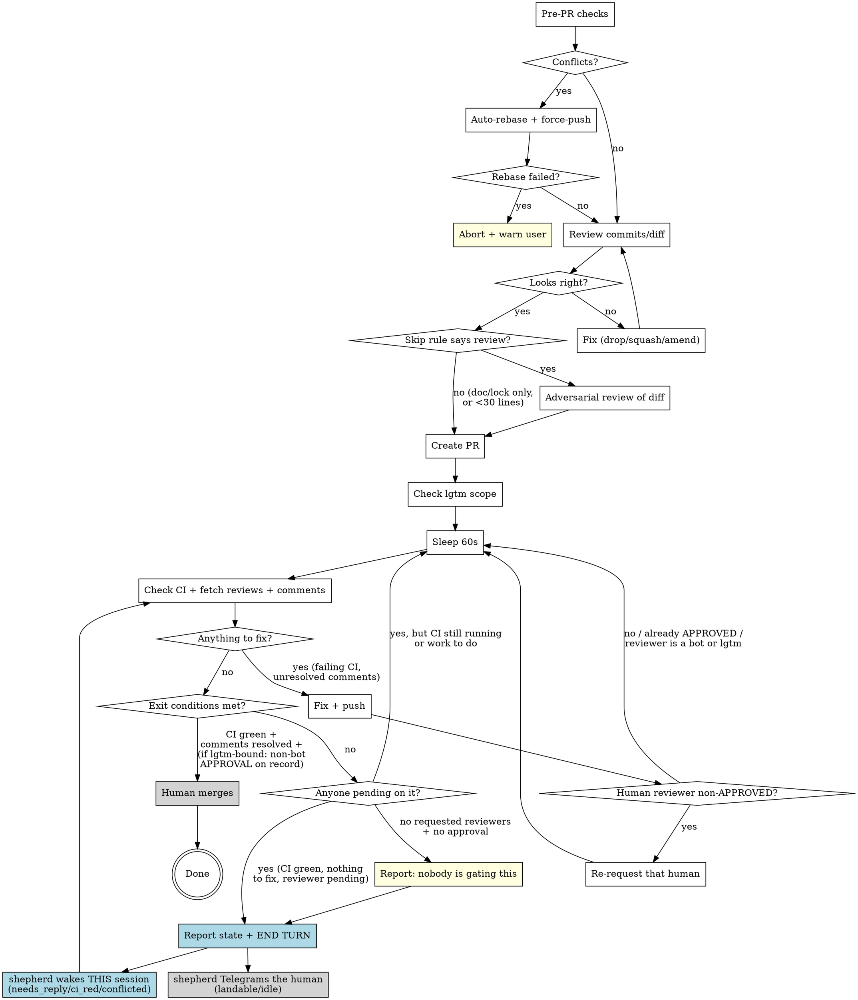

# Shepherding Pull Requests

> ## ⛔ DO NOT SCHEDULE WAKES FOR A PR — A DAEMON WATCHES NOW
>
> **Do not call `swarm_schedule` for a PR. Not once, not with a long delay, not "just one to be
> safe."** Self-scheduled wakes are gone for good, not pending redesign — see
> [reference/retired-wake-scheduling.md](reference/retired-wake-scheduling.md) for the cost model
> that killed them, which is still worth knowing.
>
> **What watches instead:** `lgtm-shepherd`, a systemd timer that sweeps open PRs every **10
> minutes**. It costs nothing when nothing is happening. **It wakes THIS SESSION, not only the
> human**, depending on the signal:
>
> | Signal | Where it goes |
> |---|---|
> | `needs_reply`, `ci_red`, `conflicted` | **an agent wake, preferentially the session that authored the PR** |
> | `landable`, `idle` | one Telegram line to the human |
>
> Verify rather than trust this table: `LGTM_ENABLE_AGENT_ROUTING=1` on the service is the master
> switch, and on cloudbox `journalctl -u lgtm-shepherd.service | grep 'routed to ses_'` shows the wakes actually
> delivered.
>
> **So when the tight loop has nothing left to do** — CI green, threads resolved, and the only thing
> outstanding is a reviewer or the user's own merge — **report the current state in plain text and
> end the turn.** Ending the turn is correct here; it is not you deciding the PR stopped being your
> problem, and it is not the end of the PR's supervision either.
>
> **Be accurate about what happens next.** A quiet PR merely awaiting a reviewer gets the *human* a
> Telegram and wakes nobody. Threads, red CI, or a conflict wake **you** — same session, same
> worktree, with a payload describing what it saw. Say which you expect. Do not tell the user a
> daemon will finish the work; it will either notify them or hand the work back to you.
>
> - **The wake budget is finite and never resets.** 8 agent wakes per signal per PR (12 across all
>   signals, 15 hard ceiling), refundable only by a wake that *shrinks* the conversation. When it
>   runs out the PR becomes human-relay for the rest of its life, and the only trace is one
>   `[wake-budget-exhausted]` log line. A PR that goes *quiet early* is the symptom.
> - **Do not do the shepherd's job for it.** No self-scheduled wakes, and no re-requesting a
>   reviewer that the daemon already re-reviews on its own (§"Re-requesting review" says when that
>   is and is not the case — it is conditional, not "never").
>
> Everything else in this skill still binds: the pre-PR checks, replying to and resolving every
> thread, and the tight 60-second loop while something is actually moving.

A PR being open is not the end of the work — it's the middle of it. Opening the PR creates a coordination cost on the reviewer's plate; walking away mid-flight pushes the rest of that cost (chasing CI, addressing comments, re-requesting review) back onto the user. The job is to land the PR or hand it off with an honest, current status. Everything in this skill is in service of that disposition.

## The standing expectation

**None of this has to be requested.** A user who tells you to reply to the comments and re-request the reviewer is repeating a default you already owed them. Treat the moment `gh pr create` returns as the start of the obligation, not the discharge of it — and treat a clean, green, uncommented PR as still owed, because it is.

From that moment, without being asked:

- **Hold the PR.** Stay in the loop until it lands, or until there is a genuine human decision only the user can make. → §"Post-PR Monitoring"
- **When a review lands, reply to every inline comment in its own thread, and mark each thread resolved.** Both, every thread, bot and human alike. → §"Loop body" step 4
- **Act on the substance with judgment** — accept, push back, or escalate. Nothing gets silently dropped. → `receiving-code-review`
- **If a HUMAN reviewer has not APPROVED, re-request them** after pushing fixes. If they already approved, do not — and never re-request a bot. lgtm is the qualified case: it re-reviews a settled head by itself only where `reviewDecision` is `REVIEW_REQUIRED`; anywhere else, re-request it once. → §"Re-requesting review"
- **Before you consider the PR held, check that something is pending on someone.** A PR can be fully answered, green, and permanently stalled. → §"The stalled-but-healthy trap"

Reporting a PR URL and treating the task as finished is the specific failure this skill exists to prevent.

## Detailed references

Everything needed for an ordinary PR is in this file. Two branches have detail worth keeping out
of the way until they apply:

- **Is this PR lgtm-bound, and must lgtm be re-requested?** → [reference/lgtm-review-mechanics.md](reference/lgtm-review-mechanics.md)
- **The retired self-scheduled wake mechanism, and why it was removed** → [reference/retired-wake-scheduling.md](reference/retired-wake-scheduling.md)

## PR Lifecycle



## PR Title

Format: `[PROJ-XXXX] Sentence case description`

- Bracket the Jira ticket: `[PROJ-6082]`, not `PROJ-6082:`
- After the prefix, sentence case -- first word is an imperative verb
- Examples:
  - `[PROJ-6082] Add cutover date to billing dashboard`
  - `[PROJ-2740] Fix order closure race condition`
  - `[NO-JIRA] Bump dependency versions`

## PR Description

Explain like you're speaking to a TPM. Prefer brevity, but not at the cost of clarity.

Template:

```markdown
#### Description

...

#### Stakeholders

...

#### References

- https://$ATLASSIAN_SITE/browse/PROJ-XXXX
```

### Section guidance

| Section | Content |
|---------|---------|
| **Description** | What changed and why, in plain language. Bullet points preferred. |
| **Stakeholders** | @ mention people who need to know or review. Omit if obvious. |
| **References** | Jira ticket link. Add Slack threads, Confluence pages, or related PRs if relevant. |

## Pre-PR Checks

Run these before `gh pr create`:

### 1. Check for merge conflicts

```bash
git fetch origin main
git rebase origin/main
```

If rebase succeeds, force-push the rebased branch. If rebase fails (conflicts can't be auto-resolved), `git rebase --abort` and warn the user.

### 2. Verify commits and diff

```bash
git log origin/<trunk>..HEAD --oneline
git diff origin/<trunk>...HEAD --stat
```

Sanity-check: are these the commits and files you expect? Use best judgement -- if something looks wrong (unrelated commits, unexpected files, merge commits from another branch), fix it (drop, squash, amend). If it looks clean, proceed.

**Always compare against `origin/<trunk>`, never local `<trunk>`.** Local `main`/`master` can be ahead of origin (unpushed commits from prior sessions, especially in worktrees where the parent repo's local trunk drifts). `git log master..HEAD` will silently hide stowaway commits, and the rebase in step 1 won't strip them either -- `origin/<trunk>` is already an ancestor of your branch, so rebase is a no-op.

If `git log origin/<trunk>..HEAD --oneline` shows more commits than you authored this session, you have stowaways. Fix:

```bash
git rebase --onto origin/<trunk> <local-trunk> <your-branch>
```

This replays only your branch-tip commits onto `origin/<trunk>`, dropping everything between `origin/<trunk>` and `<local-trunk>`.

### 3. Adversarial review of the change — by default, unasked

Dispatch `adversarial-reviewer-fable` on the diff before `gh pr create`. This is a standing default like the post-PR ones: the user should never have to ask for it, and "the change looks straightforward to me" is not a reason to skip — that judgement is exactly what the review exists to check.

**When to skip.** Decide mechanically, not by feel:

```bash
git diff --numstat origin/<trunk>...HEAD
```

Skip only if every changed path is `*.md`, `*.lock`, `flake.lock`, `package-lock.json`, or a snapshot/fixture file, **or** the diff totals under ~30 changed lines.

**Never skip on those grounds when the diff touches `assets/opencode/**` or any `AGENTS.md`.** Prose that changes how agents behave is a behavior change wearing a `.md` extension; the fact that it cannot break a compiler is exactly why nothing else will catch it.

Anything else gets reviewed. Two non-reasons to skip, both of which look like reasons:

- *"Big diff, but it's all mechanical."* Judgement call, and judgement calls are what get skipped under time pressure.
- *"It was already reviewed at plan time."* A plan-time review does not cover the implementation — the value of reviewing the diff afterward is precisely the **drift** between the design that was approved and the code that got written. Dispatch anyway, tell it where the plan-time review was, and ask for a drift check. It is cheap: the agent is instructed to answer "nothing load-bearing here" in one paragraph when that is true.

**What to send it.** A diff with no intent is unreviewable at the level this agent works at, so the dispatch must carry:

- the intent — bead ID, ticket, plan file, or the draft PR body
- the diff range (`origin/<trunk>...HEAD`) and the repo path
- whether a plan-time adversarial review already happened, and where to find it
- what is out of scope: style, naming, test structure, spec conformance (other agents own those)

**What to do with the findings.** Act on them like any review — fix, or decide not to and know why. Then:

> **Do not narrate the review to the user.** No summary of what the reviewer said, no list of findings-and-dispositions, no "the adversarial reviewer flagged X and I addressed it in Y." The fixes land in commits, where they belong; the PR description describes the change, not the process that produced it. One exception, and take it from the general rule rather than inventing a narrower one here: a finding you **declined** is reportable exactly when the route you chose instead is one the user would have vetoed — see "Reporting to Humans" in `AGENTS.md`, including its tiebreaker. Not "does it gate the merge"; that test is narrower and lets through precisely the case worth hearing about, where the implementation is hackier than the design you agreed on and works anyway.

The point of the default is that the review happens, not that it is visible.

## Post-PR Monitoring

This is where most of the actual shepherding happens, and where it's easiest to bail early. Two failure modes to watch for in yourself:

- **Treating "PR created" as a terminal state.** It isn't. CI hasn't run yet, no human has looked, no inline comments exist to address. Returning to the user at this point with a PR URL is handing them a tool to do work you were going to do; that's only the right move if you're genuinely blocked or out of scope.
- **Treating the loop as a checklist to satisfy rather than an outcome to own.** The exit conditions below describe the *minimum* state at which you can fairly say "this PR is landed or as landed as I can get it." If you find yourself looking for a reason to declare victory, you've inverted the disposition.

The right framing: you're holding the PR until it's merged or until there's a real human decision the user has to make. Polling every 60 seconds is cheap; bailing and making the user pick up the thread is expensive.

After creating the PR, enter the monitoring loop. There is no maximum number of iterations and no point at which an unmerged PR stops being yours.

**But watching is not the same as polling.** The tight 60-second loop is the right instrument only while something is actively changing — CI running, threads to answer, a push in flight. Once CI is green and the only thing left is a reviewer who hasn't looked yet, the loop is burning turns to re-read a page that nobody has edited. At that point report the state and end the turn — see §"When the only thing left is waiting". `lgtm-shepherd` brings you back if anything needs you. What changes at CI-green is the *mechanism*, never the obligation.

### Tooling: monitor-pr.py

A companion script bundled with this skill does steps 1-4 of the loop body (sleep, check CI, fetch reviews, fetch inline comments) in one invocation, and prints the exact action to take next:

```bash
python ~/.config/opencode/skills/shepherding-pull-requests/monitor-pr.py [PR]
```

Each invocation has a wall-clock budget of 60 seconds. That cap is deliberate -- Anthropic's prompt-cache TTL is 5 minutes, and a single bash call that blocks the model longer than that expires the warm cache. **While CI is still moving you are expected to re-invoke the script in a loop**; the script owns the within-60s pacing, you own the loop and the fix step. Once CI is green and only the reviewer is outstanding, stop looping, report the state and end the turn.

| Exit code | Meaning | What to do |
|---|---|---|
| `0` | All exit conditions met | Done. PR is landable. |
| `1` | Action needed (CI failed / unresolved threads / non-APPROVED review predates HEAD) | Read stdout for the specific action, do it (step 5 below), then re-invoke. |
| `2` | Unrecoverable error (could not query GitHub) | Surface to user; don't silently retry. |
| `3` | Budget elapsed, still idle-waiting (CI pending or lgtm-bound waiting on APPROVAL) | Re-invoke immediately **if CI is still moving**. If CI is green and you are only waiting on a reviewer, report the state and end the turn — see §"When the only thing left is waiting". |

`--once` runs exactly one evaluation pass and never sleeps. Use it when a shepherd wake has woken you and the session is awake only long enough to check state and then act. (It is equivalent to `--budget-seconds 0`, which already behaved this way; the flag exists to say so out loud and to print the right follow-up instruction.)

`--lgtm-bound auto` (default) reads `~/projects/lgtm/lgtm.yml` to detect lgtm-boundness -- checking both that the repo is listed AND that the PR's author is in an author allowlist (see [reference/lgtm-review-mechanics.md](reference/lgtm-review-mechanics.md) for why the second half is load-bearing) -- so the manual grep there can be skipped when the script is in use. Use `--lgtm-bound yes` / `--lgtm-bound no` to override.

**Prefer `auto`, and treat an override as a claim you owe evidence for.** The detector re-reads `lgtm.yml` on every run, so `auto` tracks config changes; a hardcoded `--lgtm-bound no` does not, and outlives whatever justified it. When you do override, the script now runs the detector anyway and labels the printed value `OVERRIDE ...` — warning on stderr when the two disagree. **A line reading `lgtm-bound: False` under an override is your own flag echoed back, never a confirmation of it.** If you are putting an override in a resumption prompt, quote the auto value beside it, because the post-compaction session cannot see how you derived it.

**What the script does NOT do:** step 5 (the fix step -- investigating failed CI, replying to inline threads, calling `resolveReviewThread`, pushing fixes, re-requesting review). Those stay yours. The script just tells you what to fix and lets you back in to do it.

The text loop body below documents the same logic by hand. Read it to understand what the script is doing -- and use it directly when working in an environment that doesn't have the script deployed.

### Approval is durable

Worth stating up front because it shapes the whole loop: **once a non-bot reviewer has APPROVED, that approval stays valid through subsequent pushes for inline-only feedback.** GitHub does not auto-dismiss approvals on push (unless the repo opts into that setting, which none of ours do). You do not need a fresh re-approval every time you address a leftover Gemini thread or fix a typo a human pointed out — the reviewer signed off on the substance; mopping up cosmetic feedback doesn't reopen the substance.

This matters in two places:

- **Re-requesting review**: don't, after an APPROVED. It's noise to the reviewer and (on lgtm-bound repos) wastes a tier-0 reawaken slot.
- **Exit conditions**: an earlier-than-last-push APPROVAL still counts. You don't have to wait for them to come back and re-approve.

If the reviewer wanted to re-prove correctness on every push, they would have left `CHANGES_REQUESTED` instead of `APPROVED`. Trust the verdict they actually gave.

### Two reviews, two roles

On a typical lgtm-bound PR you should expect to see two reviews land at very different times, with very different weight. Knowing which one you're waiting for keeps the loop honest:

| Reviewer | When it shows up | Identity in API | Role |
|---|---|---|---|
| Gemini (or other bot reviewer) | Within minutes of opening or pushing | `user.type: "Bot"` | **Advisory.** First-class when present -- read its comments carefully, address actionable threads in-line, push fixes. But its review verdict does not gate exit, on lgtm-bound or non-lgtm-bound repos. Never re-request review from it. |
| lgtm-dispatched session | ~10 min after CI goes green | `user.type: "User"` (it runs under a real human PAT, indistinguishable from a flesh-and-blood reviewer) | **Gating, on lgtm-bound repos.** This is the review you are actually waiting for. CI green + Gemini-threads-resolved is *not* a substitute -- it's a precondition for lgtm to even start. |

The temporal asymmetry is the trap. Gemini fires early, your inline-comment work is mostly done within an iteration or two, and the loop starts to feel finished. It isn't -- on lgtm-bound repos, the gating review is still ~10 min out, possibly more if CI just turned green. That's normal. Poll through it.

On non-lgtm-bound repos (this workstation repo, personal projects, OSS), there is no second review coming. Gemini's review still doesn't gate, but neither does any other -- exit on CI green + inline threads resolved.

### Once, before the loop: is this PR lgtm-bound?

`~/projects/lgtm` runs an AI review daemon on a configured set of repos. If this PR is in scope you
MUST wait for a non-bot reviewer to APPROVE before exiting — CI green plus resolved comments is
necessary but not sufficient. lgtm typically dispatches within ~10 min of CI going green.

A PR is lgtm-bound iff **the repo is listed AND the PR's author is admitted**. `monitor-pr.py`
implements the real rule (`--lgtm-bound auto`, the default); prefer it over reading `lgtm.yml`
yourself, and treat a manual override as a claim you owe evidence for.

**Fail toward lgtm-bound (keep waiting) when unsure.** Over-waiting is visible and interruptible; a
wrong early exit looks like a decision and silently drops the PR.

The full rule, the config-shape trap that produced a confident wrong answer once, and the
failure-asymmetry argument behind that default: see
[reference/lgtm-review-mechanics.md](reference/lgtm-review-mechanics.md).

### Loop body

> **Preferred:** invoke `monitor-pr.py` (see "Tooling" above) instead of doing steps 1-4 by hand. The script encodes the same logic and returns exit codes that map to "done" / "fix this" / "still waiting." The text below is the canonical spec the script implements -- read it to understand what the script is doing, and follow it directly when the script isn't deployed on this host.

1. **Sleep 60 seconds** -- `sleep 60` (in its own bash invocation, not chained with subsequent `gh` calls -- see AGENTS.md guidance on bundled sleeps). Do not use `sleep 300`: Anthropic prompt-cache TTL is 5 minutes, so a 5-minute idle gap can expire the warm cache and make the next turn pay full prompt input cost.
2. **Check CI**:
   - GitHub Actions: `gh pr checks <number>`
   - Azure DevOps: use `az pipelines` commands (discover the right invocation for the repo)
   - If failed, investigate logs and fix
3. **Fetch reviews** (the formal review verdicts, distinct from inline comments):
   ```bash
   gh api repos/{owner}/{repo}/pulls/{number}/reviews \
     --jq '.[] | {id, login: .user.login, type: .user.type, state, submitted_at}'
   ```
   - Group by `login`, take the **latest** review per reviewer (reviews are append-only; only the most recent counts)
   - `type: "Bot"` -> Gemini, dependabot, etc. Address inline comments per step 4 but **never re-request review from a bot login**.
   - `type: "User"` -> human OR an lgtm-dispatched session running under a real human PAT. Both look identical and are treated the same way: address feedback AND re-request review from this login after pushing fixes.
4. **Fetch inline comments, reply, and resolve**:
   ```bash
   gh api repos/{owner}/{repo}/pulls/{number}/comments \
     --jq '.[] | {id, login: .user.login, type: .user.type, in_reply_to_id, body: .body[:120], path, line}'
   ```
   - For each thread root (`in_reply_to_id: null`) without your reply: fix the code if actionable (or formulate pushback if not), then reply in-thread per the `reviewing-github-prs` skill, **then mark the thread resolved** via the `resolveReviewThread` GraphQL mutation (also in `reviewing-github-prs`). Applies to bot AND human threads. Reply-without-resolve leaves the thread looking abandoned in the diff UI.
   - For deciding *what* to reply (accept / push back / escalate), see the `receiving-code-review` skill — every thread gets one of those three responses; nothing gets silently dropped.
   - If a thread needs a human decision, surface it to the user before continuing.
5. **If anything was fixed in steps 2-4**, push, then:
   - **If a HUMAN reviewer's most recent review is `CHANGES_REQUESTED` or `COMMENTED`** -- they asked for changes, you addressed them, now they need to look again -- re-request that login (see §"Re-requesting review"). Nothing else re-notifies them.
   - **If their most recent review was already `APPROVED`**, do NOT re-request -- they signed off; you're just mopping up leftover inline threads. The approval stays valid; pushing fixes for inline-only feedback does not invalidate sign-off.
   - **Do not re-request or trigger-comment any bot.** Bots do not come back and should not be asked to.
   - **lgtm: check `reviewDecision` before deciding.** lgtm returns on its own once the head is settled — but only where GitHub reports `REVIEW_REQUIRED`. Anywhere else, re-request its login once. See §"Re-requesting review" for the check and why.
    - Go back to the 60-second sleep (step 1).
6. **Otherwise** (nothing to fix this iteration), evaluate exit conditions. If they are unmet and the only thing outstanding is a reviewer who hasn't looked yet, leave the loop, report the state and end the turn instead of sleeping again — see §"When the only thing left is waiting".

### Re-requesting review

**Re-request real people; leave automated reviewers alone.** After pushing fixes:

| Reviewer | Re-request? |
|---|---|
| Human whose latest review is `COMMENTED` / `CHANGES_REQUESTED` | **Yes** — nothing else re-notifies them, and `COMMENTED` means they are not satisfied |
| Anyone whose latest review is `APPROVED` | **No** — approval survives later pushes for inline-only fixes |
| A review bot (`user.type: "Bot"`) | **No**, and never post a trigger comment (`/gemini review`) at one |
| lgtm's dispatched reviewer (`user.type: "User"`) | **Conditional** — see the three cases below |

```bash
gh pr edit <n> --repo <owner>/<repo> --add-reviewer <login>
```

**The lgtm case turns on whether the head moved, not on `reviewDecision` alone:**

- **You pushed, and `reviewDecision` is `REVIEW_REQUIRED`** → do **not** re-request. lgtm re-reviews a
  settled head itself; a re-request just races the sweep.
- **You pushed, and `reviewDecision` is empty or `CHANGES_REQUESTED`** → re-request **once**. That
  sweep is structurally unable to see you and never will on this PR.
- **You replied to its threads without pushing** → re-request **once, whatever `reviewDecision`
  says.** A reply does not move the head, and nothing else reawakens lgtm; the PR sits at
  `COMMENTED` until someone presses the button.

Use the exact login from the most recent non-bot review; lgtm's pool rotates but pins to the prior
reviewer on re-review. **When `monitor-pr.py` says to re-request, it is right** — it keys on whether
that reviewer has seen the current head.

The lgtm case is genuinely conditional and has burned this skill in *both* directions — waiting
forever on a sweep that could never fire, and re-requesting where the sweep already had it. The rule
and the measured evidence: see
[reference/lgtm-review-mechanics.md](reference/lgtm-review-mechanics.md).

### Exit condition

Loop exits only when **all** of the following are true in the same iteration:

- All CI checks pass (pending -> sleep again)
- Every thread-root inline comment has your reply AND is marked resolved (bot AND human threads). Use the unresolved-threads filter query in `reviewing-github-prs` to verify before exiting.
- **If lgtm-bound**: the most recent review from a non-bot reviewer has `state == "APPROVED"`. An earlier-than-last-push approval still counts -- once they've signed off, fixes for inline-only feedback do not invalidate it. (If a reviewer wanted you to re-prove correctness, they would have left `CHANGES_REQUESTED` instead of `APPROVED`.)
- **If not lgtm-bound**: no *positive* review-state requirement (you don't need an APPROVED). But an outstanding `CHANGES_REQUESTED` or `COMMENTED` from a non-bot reviewer on the current HEAD still blocks exit -- if a human asked for changes you don't ship over them. Only stale non-APPROVED reviews (commit predates HEAD) call for a re-request; non-APPROVED reviews on the current HEAD are an idle-wait until the reviewer updates their verdict.

### The stalled-but-healthy trap

**A PR can satisfy every check in this skill and still be going nowhere.** Threads all answered and resolved, CI green, no conflicts, no standing objection — and *nobody pending on it*. No requested reviewers, no approval, `mergeStateStatus: BLOCKED`. Every component reports success and the PR never moves again.

This is not hypothetical and it is not rare. `mono#4476` reached exactly that state on 2026-09-02 and sat in it: the author had been woken twice, both wakes productive, clearing three then six threads. Answering the threads is what *created* the state.

The reason it hides so well is that it looks like the good outcome. "Green and fully answered" is the shape of a finished PR, and the check for it is not a check on the diff at all:

```bash
gh api repos/{owner}/{repo}/pulls/<n>/requested_reviewers --jq '[.users[].login]'
gh pr view <n> --json reviewDecision,mergeStateStatus -q '{d:.reviewDecision,m:.mergeStateStatus}'
```

Empty reviewers **and** no approval (`reviewDecision` of `REVIEW_REQUIRED`, `CHANGES_REQUESTED`, or empty) means nothing is pending on anyone. **Before you report a PR as held and end the turn, confirm someone is on the hook** — a human with a live review request, or lgtm with a settled head it will pick up. That second one is conditional: lgtm picks up a settled head only where `reviewDecision` is `REVIEW_REQUIRED` (see [reference/lgtm-review-mechanics.md](reference/lgtm-review-mechanics.md)). If the field is empty or `CHANGES_REQUESTED`, nobody is on the hook until you re-request lgtm once. `salmon-of-knowledge#208` sat in exactly this state on 2026-09-04 with an agent waiting for a sweep that could not reach it. If neither is true, you are the only thing standing between that PR and indefinite silence.

Note the shepherd does not rescue this either. `landable` requires an approval, so a stalled PR fails it and falls through to `idle`, which only tells the human — hours later, and only that "it has not moved."

### Merging stays with the human

**Do not run `gh pr merge`.** Holding a PR "until it lands" means holding it until *someone else* lands it. The merge is the one irreversible step in the flow and the one place the design deliberately keeps a person in the loop.

An agent violated this on 2026-09-02, running `gh pr merge <n> --squash` on a PR whose wake payload said, in as many words, "Do NOT merge. Merging stays with the human." Branch protection happened to refuse it because the PR was `BLOCKED`. **A guardrail that holds by accident is not the instruction working** — if the PR had been approved, that merge would have gone through.

An approved, green, mergeable PR is a *report*, not a cue to act: say it is ready and who needs to press the button.

### When the only thing left is waiting

Exit conditions unmet, CI green, nothing to fix, no reviewer yet → **report the state in plain text
and end the turn.** Do not keep the 60-second loop running for hours, and do not schedule a wake.
`lgtm-shepherd` takes it from there.

The tight loop is the right instrument only while something is actually changing — CI running, a
push settling. The break-even against a cold wake is around twelve minutes, which is why a wait
measured in a reviewer's queue should not be polled. The retired mechanism and that arithmetic:
[reference/retired-wake-scheduling.md](reference/retired-wake-scheduling.md).

### Common mistakes

- **Mistaking Gemini's review for the gating review.** Gemini fires early and looks like a reviewer has shown up, which makes it tempting to declare done as soon as its threads are resolved. On lgtm-bound repos, the gating review is the lgtm-dispatched one (`type: "User"`), which arrives ~10 min *after* CI goes green and is what you're actually waiting for. Address Gemini's threads, but don't exit on Gemini's signal.
- **Re-requesting review from a bot login.** Bots aren't on the lgtm reawaken loop; the request is wasted. Filter on `user.type != "Bot"` before re-requesting.
- **Poking a bot with its trigger comment.** `/gemini review` and `@claude review` are the same mistake as re-requesting them, wearing a different hat — and they *work*, so unlike a wasted API call they produce real noise on the PR. Measured 2026-09-02 on `mono#4476`.
- **Re-requesting lgtm where tier 0b can already see you.** Where `reviewDecision` is `REVIEW_REQUIRED` *and you pushed*, lgtm re-reviews a settled head itself; reaching that state is the useful action and the re-request just races the sweep.
- **Not re-requesting lgtm after answering its threads without a push.** The quieter inverse: "never re-request the pool" remembered as a rule rather than as its reason. A reply does not move the head, and nothing else reawakens lgtm; the PR sits at `COMMENTED` until someone presses the button. See [reference/lgtm-review-mechanics.md](reference/lgtm-review-mechanics.md).
- **NOT re-requesting lgtm where tier 0b cannot see you.** The mirror image, and the more expensive one: on a repo whose base branch has no review-required rule, `reviewDecision` is empty after lgtm's `COMMENTED` review (or `CHANGES_REQUESTED` after its `REQUEST_CHANGES`), tier 0b refuses forever, and "never re-request lgtm" waits indefinitely. `salmon-of-knowledge#208`, 2026-09-04. Check the field; if it is not `REVIEW_REQUIRED`, re-request once. When `monitor-pr.py` says to re-request, it is right.
- **Running `gh pr merge`.** Not yours. See §"Merging stays with the human" — and note that branch protection refusing your merge is not evidence you were allowed to try.
- **Ending the turn on a PR with nobody pending on it.** Green plus every thread resolved plus zero requested reviewers is a stalled PR that looks finished. See §"The stalled-but-healthy trap".
- **Telling the user "a daemon will pick this up" when it will only wake you.** The shepherd routes `needs_reply` / `ci_red` / `conflicted` back to *this session* and only Telegrams the human for `landable` / `idle`. Saying the wrong one leaves the user either ignoring a PR they now own or waiting on a handoff that is coming to you.
- **Re-requesting review after an APPROVED.** If the latest non-bot review is already `APPROVED`, don't re-request when you push fixes for leftover inline threads. The reviewer signed off; pinging them again to re-confirm is noise. Re-request only when the latest non-bot review is `CHANGES_REQUESTED` or `COMMENTED`.
- **Re-requesting from the wrong login.** lgtm's reviewer pool rotates, but on re-review it pins to the prior reviewer. Always use the exact login from the most recent non-bot review, not a hardcoded default.
- **Using `sleep 300` while polling.** A 5-minute idle gap can expire Anthropic's prompt cache and force the next turn to re-send the full prompt. Use `sleep 60` for monitoring loops. (This is an argument against *medium* sleeps specifically. Once you've decided to wait tens of minutes, the cache is lost either way and ending the turn is strictly cheaper than continuing to poll.)
- **Treating a wake payload as trustworthy state.** It records what was true when it was scheduled, possibly hours ago. Re-read CI, reviews, and threads before acting on any of it.
- **Bundling sleep with the follow-up `gh` calls in one bash invocation.** Long chained one-liners that include `sleep` are a known hang risk in this environment (see AGENTS.md). Run `sleep 60` as its own tool call, then run the checks.
- **Replying to inline comments without resolving them.** GitHub tracks thread resolution separately from the reply chain. A thread with five replies and no resolve still reads as unresolved in the diff UI. After every reply, call `resolveReviewThread`. See `reviewing-github-prs` §"Resolving review threads".
- **Cherry-picking the easy comments.** Addressing the agreeable comments and quietly dropping the hard or controversial ones leaves threads looking abandoned and isn't actually finishing the review. Every thread gets accept / push back / escalate — see `receiving-code-review` §"Address Every Item". Use the unresolved-threads filter query (in `reviewing-github-prs`) before claiming exit conditions met.
- **Trusting a command's output instead of checking the resulting state.** `git push -q ... | tail -3` has swallowed a *failed* push and printed a success-looking line. Measured 2026-08-09 on #4179: the branch was already checked out in another worktree, so `git checkout -b <branch> origin/<branch>` failed with `fatal: a branch named '...' already exists`; the commit then landed on a **detached HEAD**, and `git push origin <branch>` had no local branch of that name to push. The `-q`-plus-`tail` pipeline hid all of it. The reply-and-resolve round that followed would have cited a commit that was never on the remote.

  **Verify the resulting state, not the command's exit.** The same discipline catches a queued-vs-passed CI check, a re-review request sent to a login that 404s, and a "resolved" thread count taken from the REST comments endpoint instead of `reviewThreads.isResolved`.

  After any push you intend to cite, compare the three values that must agree:

  ```bash
  git rev-parse HEAD                                               # what you built
  git fetch -q origin "$BRANCH" && git rev-parse "origin/$BRANCH"  # what the remote has
  gh pr view "$PR" --json headRefOid -q .headRefOid                # what the PR will merge
  ```

  If they disagree, push explicitly from the detached HEAD rather than re-running the same command —
  and drop `-q` / `| tail` so failures are visible:

  ```bash
  git push origin HEAD:refs/heads/<branch>
  ```

## Beyond merge: confirming the rollout

On a repo with continuous deployment, a merged PR isn't live yet — the same disposition (own it until it lands) extends one phase further, to watching the change actually reach its environments. When the user cares that the change *deploys*, not just merges, hand off to the **`monitoring-deployments`** skill: it watches the merged commit roll out to each Kubernetes environment until the new image is running and healthy, and distinguishes a stuck rollout from one still in progress. Keep this skill topology-agnostic — the deploy-watching mechanics and the cluster/namespace specifics live there.
